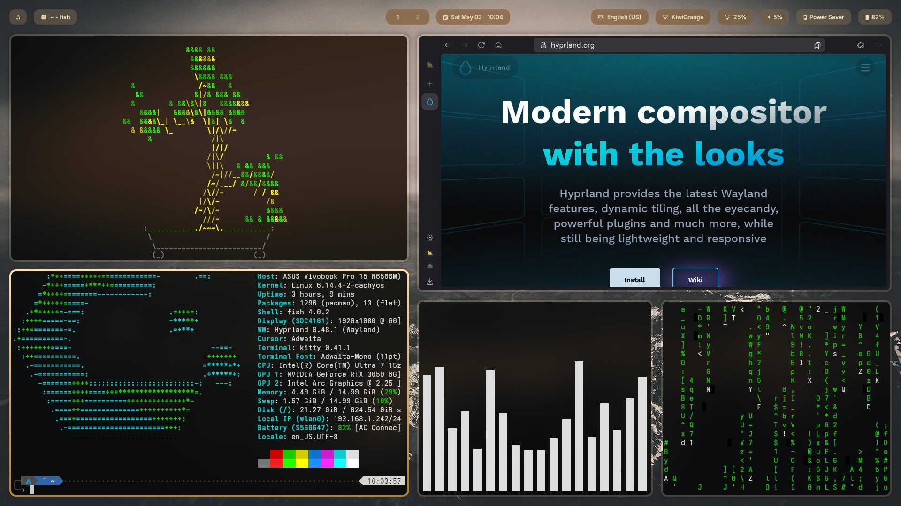
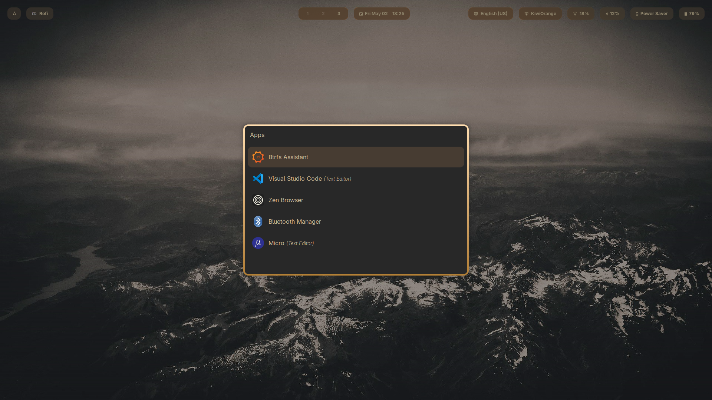

# ✨ .Gilded

A collection of my personal dotfiles and configurations for a sleek and minimalistic Linux desktop using [Hyprland](https://hyprland.org/).





## 🛠️ Installation

### Prerequisites

Before installing these dotfiles, ensure you have the following packages installed:


| Package                              | Description                                                        |
| -------------------------------------- | -------------------------------------------------------------------- |
| dunst                                | A lightweight notification daemon.                                 |
| hyprland                             | A Wayland-based tiling window manager.                             |
| kitty                                | A fast GPU-based terminal emulator.                                |
| rofi                                 | A window switcher, run dialog, ssh-launcher and dmenu replacement. |
| waybar                               | A highly customizable Wayland bar.                                 |
| lxqt-policykit (or anything similar) | A GUI policy kit authentification agent.                               |

**\* A GUI policy kit authentification agent is required ONLY if you want to use the Rofi charge limit menu. You can use any other agent you prefer.**

For my setup, I used the **Adwaita fonts** (for most of the setup) and the **Nerd fonts** (for symbols and icons). You can choose to either install those or configure the fonts in the configuration files to your desires.

I also used the [Gruvbox Plus Icon Pack by SylEleuth](https://github.com/SylEleuth/gruvbox-plus-icon-pack). Install it if you wish; it is not necessary for the setup to work.

### Manual Install

1. Clone this repository and open it locally.

```bash
git clone https://github.com/v81d/.gilded.git ~/gilded
cd ~/gilded
```

2. Backup your current dotfiles if necessary (optional).

```bash
mkdir -p ~/.config/.backup
cp -r ~/.config/* ~/.config/.backup/
```

3. Install any necessary fonts, themes, or icons mentioned above.
4. Copy the configuration files from the repository to the `~/.config` folder. Create it if it does not exist yet.

```bash
cp -r ./.config/* ~/.config/
```

5. Reboot your system to apply the changes.

```bash
sudo reboot
```

## 🔋 Battery Charge Threshold Service

I included this service here in case anyone would like to use it. Below are the instructions to install.

### Installation

Make sure you are already using the `systemd` init system. This service will automatically set the battery charge threshold to a specified value when the system boots up.

Follow these steps in the `~/.gilded` directory you created earlier.

1. Copy the service file and configuration.

```bash
sudo cp ./etc/systemd/system/battery-charge-threshold.service /etc/systemd/system/
sudo cp ./etc/default/battery_charge_threshold /etc/default/
```

2. Edit the configuration file to set your preferred charge threshold.

```bash
sudo nano /etc/default/battery_charge_threshold
```

3. Enable and start the service.

```bash
sudo systemctl enable --now battery-charge-threshold.service
```

4. Verify it's working.

```bash
cat /sys/class/power_supply/BAT0/charge_control_end_threshold
```

> **Note**: This feature requires kernel support for battery charge thresholds and may not work on all hardware. Make sure the battery path is correct. Adjust any scripts if necessary.
