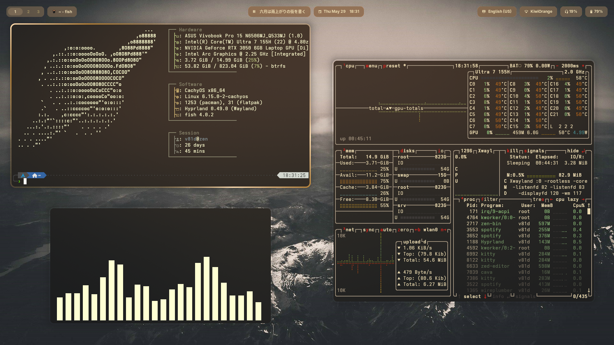
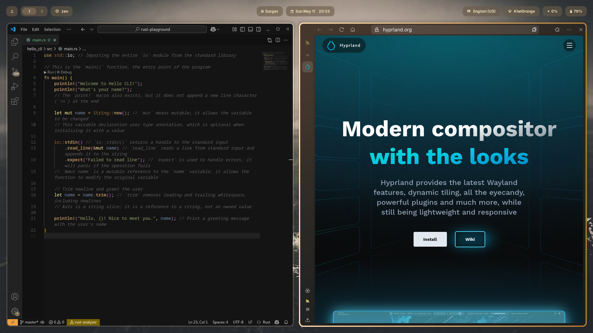
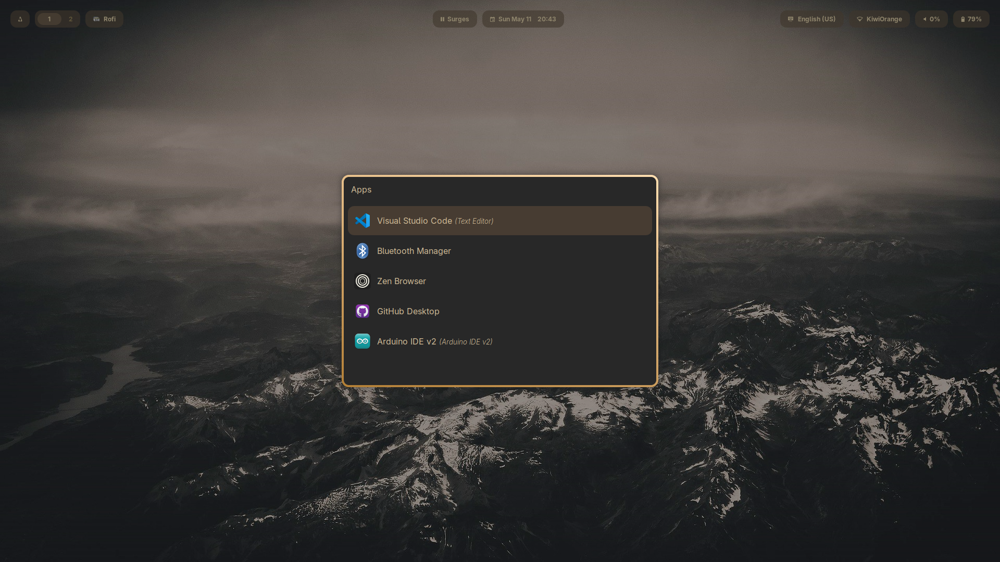
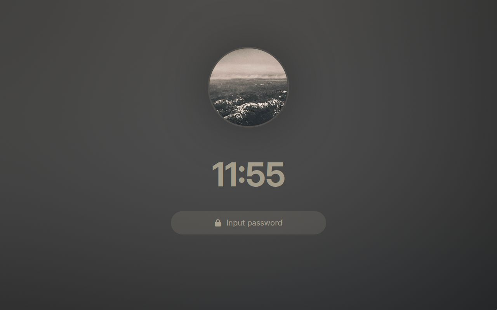

# ✨ .gilded

A collection of my personal dotfiles and configurations for a sleek and minimalistic Linux desktop using [Hyprland](https://hyprland.org/). Inspired by Gruvbox and Twilight.

|  |  |
|:------------------------------:|:------------------------------------:|
| **Terminal** | **Code Editor** |
|  |  |
| **Rofi** | **Hyprlock** |

## 🛠️ Installation

### Prerequisites

Before installing these dotfiles, check for the packages below. Of course, you do **not** need to use the exact same set of packages; however, if you choose to exclude some of these packages, you must modify the configuration files to align with your setup.

| Package                              | Description                                                                 |
|--------------------------------------|-----------------------------------------------------------------------------|
| **dunst**                            | Minimal and customizable notification daemon for X11 and Wayland environments. |
| **hyprland**                         | Dynamic tiling Wayland compositor with modern effects and flexible configuration. |
| **kitty**                            | A GPU-accelerated terminal emulator focused on speed, features, and readability. |
| **rofi**                             | Versatile launcher used for app switching, commands, and more. |
| **waybar**                           | A sleek and modular status bar for Wayland compositors like Sway and Hyprland. |
| **lxqt-policykit**                   | Graphical authentication agent for managing privileged actions in a desktop environment. |
| **hyprpaper**                        | Lightweight wallpaper manager designed specifically for Hyprland. |
| **brightnessctl**                    | Command-line utility to read and adjust screen brightness using sysfs. |
| **slurp**                            | Region selection tool for Wayland, ideal for screenshot or screen recording workflows. |
| **grim**                             | Screenshot utility for Wayland, often paired with slurp for precise region capture. |
| **fastfetch**                        | Blazing-fast system info tool for the terminal, with customizable ASCII logos. |
| **bc**                               | Precision-friendly command-line calculator for complex and floating-point math. |
| **hyprlock**                         | A highly customizable GPU-accelerated screen lock for Hyprland. |

**\* A GUI policy kit authentification agent is required ONLY if you want to use the Rofi charge limit menu. You can use any other agent you prefer. If you do NOT use a policy kit agent, make sure to adjust the necessary settings in `hyprland.conf`.**

For my setup, I used the **Adwaita** fonts (for most of the setup), the **Nerd** fonts (for symbols and icons), and **Noto** fonts (to display other characters). You can choose to either install those or configure the fonts in the configuration files to your desires.

I also used the [Gruvbox Plus Icon Pack by SylEleuth](https://github.com/SylEleuth/gruvbox-plus-icon-pack). This is not necessary for the configuration, however.

Credits to Nicholas Anand for the original [Dunst Media and Brightness Notifications](https://gitlab.com/Nmoleo/i3-volume-brightness-indicator) script. This script has been modified to align with the standards of this configuration.

### Manual Install

1. Clone this repository and open it locally.

```bash
git clone https://github.com/v81d/.gilded.git ~/gilded
cd ~/gilded
```

2. Backup your current dotfiles if necessary (optional).

```bash
mkdir -p ~/.config/.backup
cp -r ~/.config/* ~/.config/.backup/
```

3. Install any necessary fonts, themes, or icons mentioned above.

4. Copy the configuration files from the repository to the `~/.config` folder. Create it if it does not exist yet.

```bash
cp -r ./.config/* ~/.config/
```

5. Reboot your system to apply the changes.

```bash
sudo reboot
```

6. Thoroughly review your configuration files and adjust settings as needed.

> Make sure to change paths and file directories to align with your setup. For example, if you are using the .gilded Hyprlock theme, edit the `path` variable under the `image` module.
> 
> ```conf
> path = $HOME/Pictures/Profile Pictures/Aerial Mountains.jpg # Replace this with the path to your profile picture
> ```

## 🔋 Battery Charge Threshold (Integration with Rofi)

I included this service here in case anyone would like to use it. Below are the instructions to install.

### Installation

Make sure you are already using the `systemd` init system. This service will automatically set the battery charge threshold to a specified value when the system boots up.

Follow these steps in the `~/gilded` directory you created earlier.

1. Copy the service file and configuration.

```bash
sudo cp ./etc/systemd/system/battery-charge-threshold.service /etc/systemd/system/
sudo cp ./etc/default/battery_charge_threshold /etc/default/
```

2. Edit the configuration file to set your preferred charge threshold.

```bash
sudo nano /etc/default/battery_charge_threshold
```

3. Enable and start the service.

```bash
sudo systemctl enable --now battery-charge-threshold.service
```

4. Verify it's working.

```bash
cat /sys/class/power_supply/BAT0/charge_control_end_threshold
```

> **Note**: This feature requires kernel support for battery charge thresholds and may not work on all hardware. Make sure the battery path is correct. Adjust any scripts if necessary.
