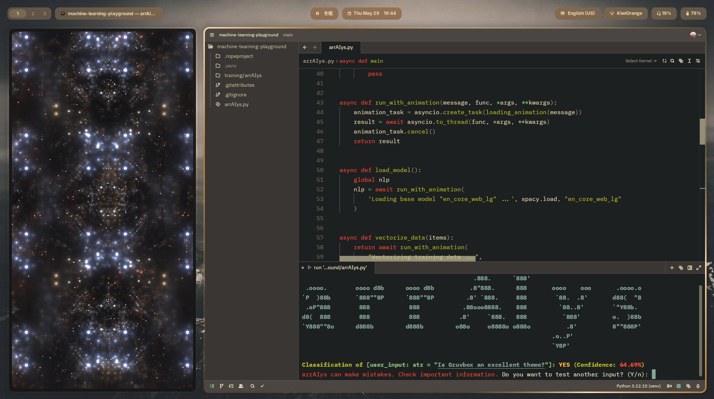
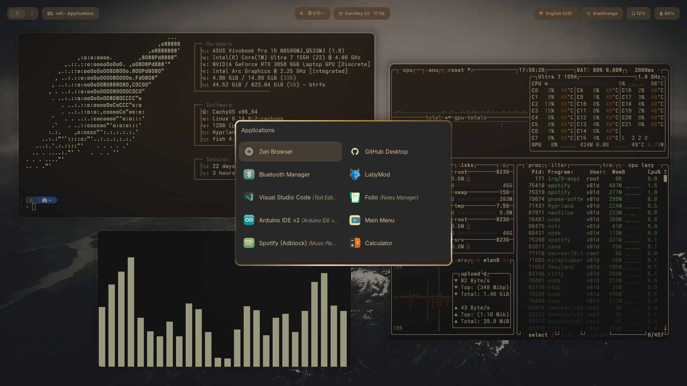
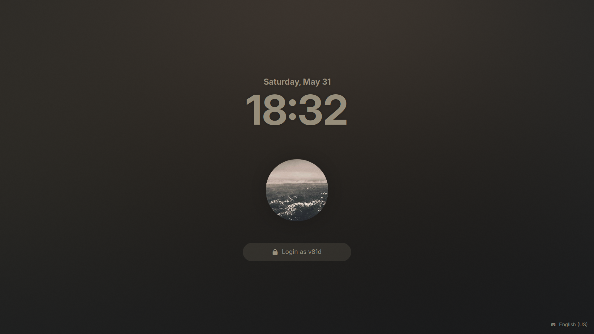
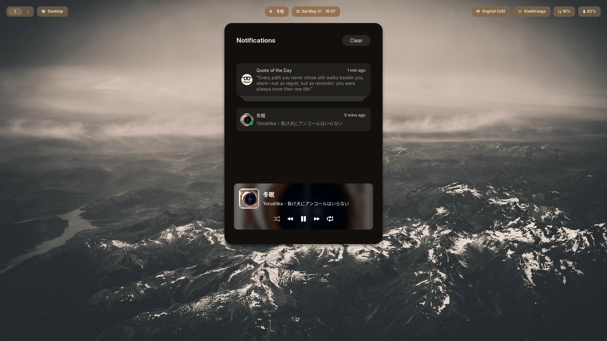

# ✨ .gilded

A collection of my personal dotfiles and configurations for a sleek and minimalistic Linux desktop using [Hyprland](https://hyprland.org/). Inspired by Gruvbox and Twilight.

<table style="width: 100%; table-layout: fixed; border-collapse: collapse;">
  <tr>
    <td style="width: 50%; text-align: center; vertical-align: middle;">
      
    </td>
    <td style="width: 50%; text-align: center; vertical-align: middle;">
      
    </td>
  </tr>
  <tr>
    <td style="width: 50%; text-align: center; font-weight: bold;">Terminal</td>
    <td style="width: 50%; text-align: center; font-weight: bold;">Workflow</td>
  </tr>
  <tr>
    <td style="width: 50%; text-align: center; vertical-align: middle;">
      
    </td>
    <td style="width: 50%; text-align: center; vertical-align: middle;">
      
    </td>
  </tr>
  <tr>
    <td style="width: 50%; text-align: center; font-weight: bold;">Launcher</td>
    <td style="width: 50%; text-align: center; font-weight: bold;">Lock Screen</td>
  </tr>
  <tr>
    <td style="width: 50%; text-align: center; vertical-align: middle;">
      
    </td>
    <td style="width: 50%; text-align: center; vertical-align: middle;">
      
    </td>
  </tr>
  <tr>
    <td style="width: 50%; text-align: center; font-weight: bold;">Desktop</td>
    <td style="width: 50%; text-align: center; font-weight: bold;">Notification Center</td>
  </tr>
</table>

## 🛠️ Installation

### Prerequisites

Before installing these dotfiles, check for the packages below. Of course, you do **not** need to use the exact same set of packages; however, if you choose to exclude some of these packages, you must modify the configuration files to align with your setup.

| Package | Description |
|-|-|
| **adw-gtk-theme** | The theme from Libadwaita ported to GTK 3. |
| **bc** | Precision-friendly command-line calculator for complex and floating-point math. |
| **brightnessctl** | Command-line utility to read and adjust screen brightness using sysfs. |
| **fastfetch** | Blazing-fast system info tool for the terminal, with customizable ASCII logos. |
| **hyprland** | Dynamic tiling Wayland compositor with modern effects and flexible configuration. |
| **hyprlock** | A highly customizable GPU-accelerated screen lock for Hyprland. |
| **hyprpaper** | Lightweight wallpaper manager designed specifically for Hyprland. |
| **hyprpicker** | A color picker for Wayland. Necessary to enable screen freezing with the `hyprshot` utility. |
| **hyprshot** | A utility to easily take screenshots in Hyprland using your mouse. |
| **kitty** | A GPU-accelerated terminal emulator focused on speed, features, and readability. |
| **polkit-gnome \*** | Graphical authentication agent for managing privileged actions in a desktop environment. |
| **rofi** | Versatile launcher used for app switching, commands, and more. |
| **swaync \*\*** | A feature-rich and highly customizable notification center. |
| **ttf-jetbrains-mono-nerd** | The JetBrains Mono Nerd Font families. |
| **waybar** | A sleek and modular status bar for Wayland compositors like Sway and Hyprland. |
| **xdg-desktop-portal-gtk** | A backend implementation for xdg-desktop-portal that uses GTK and various pieces of GNOME infrastructure. |

\* You can use any other policy kit agent you prefer. Make sure to adjust any necessary settings.

---

To replicate my exact setup, you should install the **Adwaita** fonts and the **JetBrains Mono Nerd Font**. If you want to use a different set of fonts, you must edit the configuration files.

### Full Installation

1. Clone this repository and open it locally.

```bash
git clone https://github.com/v81d/.gilded.git ~/gilded
cd ~/gilded
```

2. Backup your current dotfiles if necessary (optional).

```bash
mkdir -p ~/.config/.backup
cp -r ~/.config/* ~/.config/.backup/
```

3. Install any necessary fonts, themes, or icons mentioned above.

4. Copy the configuration files from the repository to the `~/.config` folder. Create it if it does not exist yet.

```bash
cp -r ./.config/* ~/.config/
```

5. Reboot your system to apply the changes.

```bash
sudo reboot
```

6. Thoroughly review your configuration files and adjust settings as needed.

> Make sure to change paths and file directories to align with your setup.

## 🔋 Battery Charge Threshold (Integration with Rofi)

I included this service here in case anyone would like to use it. Below are the instructions to install.

### Installation

Make sure you are already using the `systemd` init system. This service will automatically set the battery charge threshold to a specified value when the system boots up.

Follow these steps in the `~/gilded` directory you created earlier.

1. Copy the service file and configuration.

```bash
sudo cp ./etc/systemd/system/battery-charge-threshold.service /etc/systemd/system/
sudo cp ./etc/default/battery_charge_threshold /etc/default/
```

2. Edit the configuration file to set your preferred charge threshold.

```bash
sudo nano /etc/default/battery_charge_threshold
```

3. Enable and start the service.

```bash
sudo systemctl enable --now battery-charge-threshold.service
```

4. Verify it's working.

```bash
cat /sys/class/power_supply/BAT0/charge_control_end_threshold
```

> **Note**: This feature requires kernel support for battery charge thresholds and may not work on all hardware. Make sure the battery path is correct. Adjust any scripts if necessary.

## 🪫 Power Saving Tools

Below is a list of power saving tools that I personally use to keep my power usage low. I am leaving this mostly as a note to myself, but you never know—someone may find this useful!

| Package | Description |
|-|-|
| **Power Profiles Daemon** | A background service that manages system-wide power settings dynamically. Allows users and applications to switch between predefined power profiles (performance, balanced, and power-saver). |
| **Thermald** | A daemon that monitors and controls system temperatures to prevent overheating. |

These two packages brought my power usage from about 17.0 watts to 11.7 watts idle. However, I also discovered, after several months of tinkering, that the following kernel parameters can also significantly boost battery life:

| Parameter | Description |
|-|-|
| **i915.enable_psr=2** | Saves power by stopping updates to the screen if nothing changes. Use with caution, as some monitors experience flickering issues with PSR2. |
| **i915.enable_dc=2** | Enables deeper power saving for display hardware. Can cause instability or flickering on some systems. |
| **i915.enable_fbc=1** | Compresses the framebuffer to reduce memory bandwidth. Can cause artifacts on some systems, but usually safe to try. |
| **pcie_aspm=force** | Forces ASPM to be enabled even if BIOS disables it. Saves power during low activity, but can break devices on buggy firmware/hardware. |
| **pcie_aspm.policy=powersupersave** | Controls PCIe ASPM policy via the kernel's module parameter (sysfs lever) at boot. Setting it to powersupersave enables the most aggressive power-saving mode. |

These kernel settings decreased by idle power usage from about 11.7 watts to 7.5 watts idle, which is a massive boost in terms of battery life (around 5.5 hours to nearly 9 hours idle).
If you plan to use these, please do so with caution. Remember to test these temporarily before you apply them permanently.
* Note that the `i915` kernel parameters are only used for specific Intel graphics cards.
* Furthermore, the `pcie_aspm=force` and `pcie_aspm.policy=powersupersave` kernel parameters may be risky on older hardware, as some PCIe devices (especially older or cheap Wi-Fi cards, NVMe SSDs, or certain USB controllers) do not handle ASPM correctly, even if they claim to support it.
